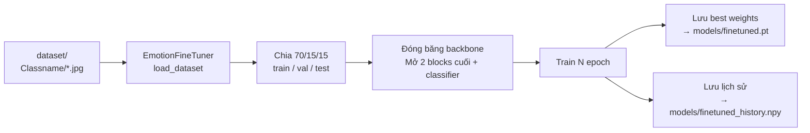
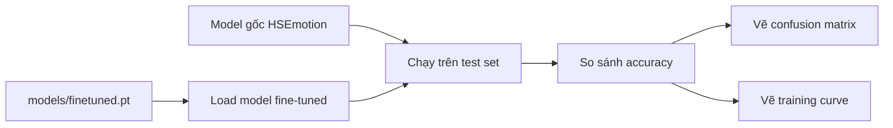
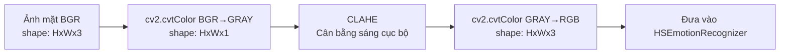

# 📘 Giải Thích Dự Án: Nhận Diện Cảm Xúc Người Học Online

**Môn học:** Khai thác thông tin đa phương tiện
**Công nghệ:** Python + OpenCV + HSEmotion (EfficientNet) + PyTorch
**Tác giả:** ...

---

## Mục Lục

1. [Tổng quan dự án](#1-tổng-quan-dự-án)
2. [Cấu trúc thư mục](#2-cấu-trúc-thư-mục)
3. [Sơ đồ luồng dữ liệu (Data Flow)](#3-sơ-đồ-luồng-dữ-liệu)
4. [Giải thích từng file và từng hàm](#4-giải-thích-từng-file)
   - [4.1. `main.py` — File chính (entry point)](#41-mainpy)
   - [4.2. `src/constants.py` — Hằng số dùng chung](#42-srcconstantspy)
   - [4.3. `src/capture.py` — Xử lý camera](#43-srccapturepy)
   - [4.4. `src/emotion_engine.py` — Engine nhận diện cảm xúc](#44-srcemotion_enginepy)
   - [4.5. `src/image_predictor.py` — Nhận diện từ ảnh tĩnh](#45-srcimage_predictorpy)
   - [4.6. `src/file_tuner.py` — Fine-tune model](#46-srcfile_tunerpy)
   - [4.7. `src/evaluator.py` — Đánh giá model](#47-srcevaluatorpy)
5. [Giải thích các khái niệm chuyên môn](#5-giải-thích-khái-niệm)
6. [Câu hỏi bảo vệ và câu trả lời gợi ý](#6-câu-hỏi-bảo-vệ)

---

## 1. Tổng quan dự án

### 1.1. Dự án này làm gì?

Đây là một chương trình **nhận diện cảm xúc trên khuôn mặt người** theo thời gian thực. Bạn mở webcam lên, chương trình sẽ:

1. **Phát hiện khuôn mặt** trong khung hình (dùng Haar Cascade).
2. **Cắt riêng từng khuôn mặt** ra.
3. **Đưa qua mô hình AI** (EfficientNet đã được huấn luyện trên hàng trăm nghìn ảnh) để dự đoán xem khuôn mặt đó đang thể hiện cảm xúc gì.
4. **Hiển thị kết quả** ngay trên màn hình: khung màu quanh mặt + tên cảm xúc + độ tin cậy.

Ngoài chế độ webcam, chương trình còn có thể:

- Nhận diện từ **ảnh tĩnh** (file `.jpg`, `.png`, ...)
- Nhận diện từ **file video** (`.mp4`, `.avi`, ...)
- **Fine-tune** (huấn luyện thêm) mô hình với bộ ảnh tự sưu tầm
- **Đánh giá** và so sánh chất lượng model gốc vs model đã fine-tune

### 1.2. Công nghệ và thư viện sử dụng

| Thư viện                 | Phiên bản | Dùng để làm gì?                                             |
| ------------------------ | --------- | ----------------------------------------------------------- |
| `opencv-python`          | 4.9.0     | Đọc hình từ camera/file, vẽ hình chữ nhật, xử lý ảnh        |
| `hsemotion`              | 0.2.0     | Cung cấp mô hình HSEmotion (EfficientNet) đã huấn luyện sẵn |
| `torch` (PyTorch)        | 2.2.0     | Chạy mô hình neural network, tính toán trên GPU/CPU         |
| `torchvision`            | 0.17.0    | Các hàm biến đổi ảnh (resize, chuẩn hoá) và load dataset    |
| `timm`                   | 0.9.16    | Tạo kiến trúc EfficientNet (thư viện PyTorch Image Models)  |
| `scikit-learn`           | 1.4.1     | Confusion matrix, classification report, accuracy score     |
| `matplotlib` + `seaborn` | —         | Vẽ biểu đồ (training curve, confusion matrix heatmap)       |
| `numpy`                  | 1.26.4    | Xử lý mảng số liệu                                          |

**Tại sao dùng HSEmotion?**
HSEmotion là thư viện nhận diện cảm xúc khuôn mặt do Đại học ITMO (Nga) phát triển. Nó dùng mạng EfficientNet — một kiến trúc neural network nhẹ, chạy nhanh nhưng vẫn chính xác — đã được huấn luyện trên bộ ảnh AffectNet (hơn 450,000 ảnh khuôn mặt gán nhãn cảm xúc).

### 1.3. Kiến trúc tổng thể

```
                    ┌─────────────────┐
                    │    main.py      │  ← Entry point, dispatch các chế độ
                    └────────┬────────┘
                             │
          ┌──────────────────┼──────────────────────┐
          │                  │                      │
   ┌──────▼──────┐   ┌──────▼──────┐    ┌─────────▼──────────┐
   │  Webcam     │   │  Image/     │    │  Fine-tune /        │
   │  Capture    │   │  Video      │    │  Evaluate           │
   └──────┬──────┘   └──────┬──────┘    └─────────┬──────────┘
          │                  │                      │
          └──────────┬───────┘                      │
                     │                              │
          ┌──────────▼──────────┐       ┌───────────▼───────────┐
          │  emotion_engine.py   │       │  file_tuner.py        │
          │  (HSEmotion + các    │       │  + evaluator.py        │
          │   kỹ thuật nâng cao) │       │  (huấn luyện + đánh   │
          └─────────────────────┘       │   giá thêm)            │
                                         └───────────────────────┘
```

---

## 2. Cấu trúc thư mục

```
kthac/                          ← Thư mục gốc của dự án
│
├── main.py                      ← File chính, chạy chương trình từ đây
│
├── requirements.txt             ← Danh sách thư viện cần cài đặt
│
├── GIAI_THICH_DU_AN.md          ← File này — tài liệu giải thích
│
├── src/                         ← Thư mục chứa mã nguồn chính
│   ├── constants.py             ← Hằng số: màu sắc, tên cảm xúc
│   ├── capture.py               ← Lớp CameraCapture — mở/đọc/tắt camera
│   ├── emotion_engine.py        ← Lớp EmotionEngine — "trái tim" của hệ thống
│   ├── image_predictor.py       ← Lớp ImagePredictor — nhận diện từ ảnh tĩnh
│   ├── file_tuner.py            ← Lớp EmotionFineTuner — huấn luyện thêm model
│   └── evaluator.py             ← Lớp ModelEvaluator — đánh giá kết quả
│
├── dataset/                     ← Ảnh dùng để fine-tune (tự sưu tầm)
│   ├── Anger/                   ← 20 ảnh mặt tức giận
│   ├── Disgust/                 ← 20 ảnh mặt ghê tởm
│   ├── Fear/                    ← 20 ảnh mặt sợ hãi
│   ├── Happiness/               ← 20 ảnh mặt vui
│   ├── Neutral/                 ← 20 ảnh mặt bình thường
│   ├── Sadness/                 ← 20 ảnh mặt buồn
│   ├── Surprise/                ← 20 ảnh mặt ngạc nhiên
│   └── README.md                ← Hướng dẫn tạo dataset
│
├── models/                      ← Thư mục chứa file .pt (weights) sau fine-tune
│                                 (hiện tại trống, sẽ có sau khi chạy fine-tune)
│
└── reports/                     ← Thư mục chứa biểu đồ đánh giá
                                  (hiện tại trống, sẽ có sau khi chạy evaluate)
```

---

## 3. Sơ đồ luồng dữ liệu

### 3.1. Luồng tổng quát (cả 3 chế độ webcam/image/video)

```mermaid
flowchart TD
    A[Chọn chế độ: webcam / image / video] --> B{Bắt đầu}

    B --> C1[webcam: mở camera]
    B --> C2[image: đọc file ảnh]
    B --> C3[video: mở file video]

    C1 --> D[Đọc 1 frame]
    C2 --> D
    C3 --> D

    D --> E[emotion_engine.process_frame]

    E --> F[detect_faces<br>Phát hiện khuôn mặt]
    F --> G{ Có mặt? }
    G -->|Không| H[Bỏ qua frame]
    G -->|Có| I[Với mỗi khuôn mặt]

    I --> J[Crop ảnh mặt]
    J --> K[_preprocess_face<br>Gray → CLAHE → RGB]
    K --> L[HSEmotionRecognizer<br>predict_emotions<br>→ ra 8 số (xác suất)]
    L --> M[Temporal Smoothing<br>Lấy trung bình 10 frame]
    M --> N[Adaptive Threshold<br>So sánh với ngưỡng riêng]
    N --> O{ Quá ngưỡng? }
    O -->|Không| P[Trả về Neutral]
    O -->|Có| Q[Trả về emotion có điểm cao nhất]

    P --> R[Vẽ kết quả lên frame]
    Q --> R

    R --> S[Hiển thị ra màn hình<br>hoặc lưu file]
    S --> T{Còn frame?}
    T -->|Còn| D
    T -->|Hết| U[Kết thúc]
```

### 3.2. Luồng fine-tune



### 3.3. Luồng evaluate



---

## 4. Giải thích từng file và từng hàm

### 4.1. `main.py`

**Vai trò:** File chính của chương trình. Khi bạn gõ `python main.py --mode webcam`, file này là file đầu tiên được chạy. Nó làm 3 việc:

1. Đọc các tham số từ dòng lệnh (bạn muốn chạy chế độ nào? dùng model gì? ...)
2. Dựa vào chế độ, gọi đúng hàm xử lý tương ứng.
3. Bắt lỗi nếu có.

#### Hàm `main()` (dòng 482)

```python
def main():
    parser = build_parser()       # Tạo "bộ phân tích" tham số dòng lệnh
    args = parser.parse_args()    # Đọc tham số bạn gõ → chứa vào args
    dispatch = {
        'webcam':   run_webcam,
        'image':    run_image,
        'video':    run_video,
        'finetune': run_finetune,
        'evaluate': run_evaluate,
    }
    dispatch[args.mode](args)     # Gọi đúng hàm theo mode
```

Giải thích từng bước:

- `build_parser()` gọi xuống hàm cùng tên ở cuối file (dòng 425). Hàm này tạo ra một đối tượng `ArgumentParser` — công cụ của Python để đọc tham số dòng lệnh. Nó định nghĩa các tham số như `--mode`, `--model`, `--input`, `--weights`, `--epochs`, ...
- `args` là một object chứa tất cả giá trị bạn đã gõ. Ví dụ: nếu bạn gõ `python main.py --mode webcam --camera 1` thì `args.mode = 'webcam'` và `args.camera = 1`.
- `dispatch` là một **từ điển** (dict). Nó map tên chế độ (string) → tên hàm. Cách này gọi là "dispatch pattern" — thay vì viết 5 câu `if/else`, ta gom vào một dict cho gọn.
- Dòng cuối: `dispatch[args.mode](args)` lấy hàm từ dict rồi gọi nó với `args`.

#### Hàm `build_parser()` (dòng 425)

Hàm này định nghĩa tất cả tham số mà chương trình chấp nhận. Mỗi `parser.add_argument(...)` là một tham số:

```python
parser.add_argument('--mode', type=str, default='webcam',
                    choices=['webcam', 'image', 'video', 'finetune', 'evaluate'],
                    help='Che do chay (mac dinh: webcam)')
```

- `--mode`: chọn chế độ chạy, mặc định là `webcam`. `choices=[...]` giới hạn chỉ được gõ 1 trong 5 chế độ.
- `--model` (dòng 446): chọn tên model HSEmotion. Có 3 lựa chọn: `enet_b0_8_best_afew`, `enet_b0_8_best_vgaf`, `enet_b2_8`. Mặc định là cái đầu tiên — EfficientNet-B0 huấn luyện trên AffectNet với 8 lớp cảm xúc.
- `--weights` (dòng 449): đường dẫn tới file `.pt` (PyTorch weights) nếu bạn muốn dùng model đã fine-tune.
- `--camera` (dòng 453): ID camera (0 là camera mặc định, 1 là webcam rời).
- `--input`, `--output`: dùng cho chế độ image/video.
- `--dataset`, `--epochs`, `--lr`, `--batch-size`, `--save-weights`: dùng cho fine-tune.

#### Hàm `run_webcam(args)` (dòng 37)

Đây là chế độ chính — chạy webcam real-time.

```
┌──────────────────────────────────────────────────────────────┐
│ Luồng chạy webcam:                                            │
│                                                               │
│  Mở camera ──► Vòng lặp vô hạn (while True) ──► Đọc frame    │
│       │                                                       │
│       ├── frame thứ 1,3,5,7... (skip_frames != 0)            │
│       │   └── Vẽ kết quả cũ, không chạy AI (tiết kiệm CPU)   │
│       │                                                       │
│       ├── frame thứ 2,4,6,8... (skip_frames == 0)            │
│       │   └── Chạy AI → vẽ kết quả mới                       │
│       │                                                       │
│       └── Xử lý phím bấm                                      │
│           ├── q/ESC: thoát                                    │
│           ├── s: chụp ảnh màn hình                            │
│           └── r: reset buffer (làm mới temporal smoothing)    │
└──────────────────────────────────────────────────────────────┘
```

Chi tiết:

- **Dòng 44:** `CameraCapture(camera_id=args.camera)` — tạo đối tượng điều khiển camera.
- **Dòng 45:** `EmotionEngine(model_name=..., weights_path=...)` — tạo "engine" nhận diện cảm xúc. Đây là lúc model AI được tải vào bộ nhớ.
- **Dòng 57-58:** `skip_frames = 2` — nghĩa là chỉ mỗi 2 frame mới chạy AI, frame còn lại vẽ lại kết quả cũ. Lý do: AI chạy chậm hơn camera, nếu xử lý mọi frame sẽ bị giật.
- **Dòng 63-86:** Vòng lặp `while True` — đây là vòng lặp chính của webcam:
  - Đọc frame (dòng 64)
  - Nếu là frame bị skip (dòng 71): vẽ lại kết quả cũ lên frame hiện tại, gọi `_handle_key` để kiểm tra phím bấm.
  - Nếu là frame cần xử lý (dòng 78): gọi `engine.process_frame(frame)` — đây là lệnh quan trọng nhất, chạy AI detect face + predict emotion.
  - Vẽ overlay (khung màu + text) lên frame (dòng 82)
  - Hiển thị frame ra cửa sổ (dòng 83)
- **Dòng 88-95:** `try/except/finally` — xử lý khi người dùng ấn Ctrl+C hoặc tắt cửa sổ. Trong `finally` luôn giải phóng camera.

#### Hàm `_draw_webcam_overlay(frame, results, frame_count, start_time)` (dòng 98)

**Công việc:** Nhận một frame gốc + kết quả nhận diện → vẽ các hình trang trí lên đó.

- **Dòng 102-113:** Với mỗi khuôn mặt tìm được:
  - `result['bbox']` = `(x, y, w, h)` — toạ độ góc trên-trái, chiều rộng, chiều cao.
  - Vẽ hình chữ nhật màu quanh mặt: `cv2.rectangle(display, (x,y), (x+w, y+h), color, 2)`.
  - `color` lấy từ `EMOTION_COLORS` dựa trên tên cảm xúc. Ví dụ: Happy → xanh lá, Angry → đỏ.
  - Vẽ label (tên + % tin cậy) phía trên khung chữ nhật.
- **Dòng 115-125:** Vẽ thông tin ở góc trên trái: số frame, FPS, số khuôn mặt.
- **Dòng 128-130:** Vẽ hướng dẫn "q: thoat | s: chup anh | r: reset" ở góc dưới.

#### Hàm `_handle_key(camera, current_frame, engine)` (dòng 135)

Kiểm tra người dùng bấm phím gì:

- `q` hoặc `ESC` → trả về `'quit'`, vòng lặp `while True` sẽ `break`.
- `s` → lưu frame hiện tại thành file `.jpg` trong thư mục `data/`.
- `r` → xoá buffer temporal smoothing, làm mới bộ nhớ đệm của engine (reset các kết quả trung bình).

#### Hàm `run_image(args)` (dòng 157)

Rất đơn giản: tạo `ImagePredictor` rồi gọi `.predict()` với đường dẫn ảnh.

#### Hàm `run_video(args)` (dòng 182)

Giống `run_webcam` nhưng đọc từ file video thay vì camera. Có thêm:

- Thanh tiến trình ở dưới cùng (dòng 301-305).
- Phím `SPACE` để tạm dừng/tiếp tục.
- Có thể lưu video kết quả ra file `.mp4` (nếu gõ `--output result.mp4`).

**Điểm khác biệt so với webcam:** Khi chạy video, bạn biết trước tổng số frame (`total_frames`), nên có thể tính % hoàn thành và vẽ progress bar.

#### Hàm `run_finetune(args)` (dòng 328)

Gọi `EmotionFineTuner` để huấn luyện thêm model. Chi tiết xem ở [mục 4.6](#46-srcfile_tunerpy).

#### Hàm `run_evaluate(args)` (dòng 365)

Load 2 model (gốc + fine-tuned), chạy trên test set, so sánh kết quả. Chi tiết xem ở [mục 4.7](#47-srcevaluatorpy).

---

### 4.2. `src/constants.py`

**Vai trò:** Chứa các hằng số dùng chung — màu sắc, tên nhãn cảm xúc, map tên.

```python
# Mau BGR cho tung emotion (OpenCV format)
EMOTION_COLORS = {
    'Happy':    (0, 255, 0),      # Xanh lá
    'Sad':      (255, 80, 80),    # Đỏ nhạt
    'Angry':    (0, 0, 255),      # Đỏ
    'Surprise': (0, 165, 255),    # Cam
    'Neutral':  (180, 180, 180),  # Xám
    'Fear':     (180, 0, 180),    # Tím
    'Disgust':  (0, 160, 160),    # Xanh lục
}
```

**Giải thích:**

- Màu BGR (Blue-Green-Red) là định dạng màu của OpenCV, khác với RGB thông thường. Bộ ba `(0, 255, 0)` nghĩa là: Blue=0, Green=255, Red=0 → màu xanh lá.
- Các màu sắc này được dùng khi vẽ khung chữ nhật quanh khuôn mặt và label.
- Nếu một cảm xúc không có trong dict (ví dụ giả sử có emotion mới), `EMOTION_COLORS.get(emotion, (255,255,255))` sẽ trả về màu trắng mặc định.

```python
EMOTION_DISPLAY_MAP = {
    'Anger': 'Angry',
    'Happiness': 'Happy',
    'Sadness': 'Sad',
    'Contempt': 'Disgust',
}
```

**Tác dụng:** Model HSEmotion output ra 8 lớp với tên: `Anger`, `Contempt`, `Disgust`, `Fear`, `Happiness`, `Neutral`, `Sadness`, `Surprise`. Nhưng với người dùng, "Angry" dễ hiểu hơn "Anger", "Happy" dễ hiểu hơn "Happiness". Map này chuyển đổi tên. Đặc biệt, `Contempt` (khinh bỉ) được map luôn thành `Disgust` (ghê tởm) vì ít người hiểu "Contempt" là gì.

```python
EMOTION_LABELS_8 = [
    'Anger', 'Contempt', 'Disgust', 'Fear',
    'Happiness', 'Neutral', 'Sadness', 'Surprise'
]

EMOTION_LABELS_7 = [
    'Anger', 'Disgust', 'Fear', 'Happiness', 'Neutral', 'Sadness', 'Surprise'
]
```

- `EMOTION_LABELS_8`: 8 lớp đầy đủ theo thứ tự output của model HSEmotion.
- `EMOTION_LABELS_7`: 7 lớp (bỏ Contempt) dùng khi thu thập dữ liệu.

---

### 4.3. `src/capture.py`

**Vai trò:** Cung cấp lớp `CameraCapture` để làm việc với camera — mở, đọc frame, đóng, vẽ chữ, vẽ box.

#### Lớp `CameraCapture`

**`__init__(self, camera_id=0)`** (dòng 17)
Lưu ID camera (số 0 = camera tích hợp laptop, 1 = webcam rời).

**`open_camera(self) -> bool`** (dòng 25)

1. Thử mở camera bằng DirectShow (`cv2.CAP_DSHOW`) — backend ổn định hơn trên Windows.
2. Nếu thất bại, thử lại với backend mặc định.
3. Đặt độ phân giải 640x480 — đủ để nhận diện mặt mà không quá nặng cho CPU.
4. Trả về `True` nếu thành công.

**`read_frame(self) -> Tuple[bool, Optional[np.ndarray]]`** (dòng 37)
Đọc một khung hình. Trả về cặp `(thành_công_hay_không, dữ_liệu_ảnh)`. Dữ liệu ảnh là một numpy array shape `(480, 640, 3)` — 480 pixel chiều cao, 640 pixel chiều rộng, 3 kênh màu BGR.

**`release_camera(self)`** (dòng 45)
Đóng camera, giải phóng tài nguyên. **Quan trọng:** Nếu không gọi hàm này, camera sẽ bị khoá ở lần chạy sau.

**`draw_text(...)`** (dòng 49)
Vẽ một dòng chữ lên frame có nền đen đằng sau cho dễ đọc.

**`draw_emotion_box(...)`** (dòng 67)
Vẽ một hình chữ nhật quanh khuôn mặt và ghi tên cảm xúc + độ tin cậy phía trên.

**`show_frame(...)`** (dòng 86): Hiển thị frame ra cửa sổ.
**`wait_key(...)`** (dòng 90): Chờ người dùng bấm phím (1ms nếu không có phím).
**`destroy_all_windows()`** (dòng 96): Đóng tất cả cửa sổ OpenCV.
**`get_frame_size()`** (dòng 99): Lấy kích thước khung hình đang xử lý.
**`get_fps()`** (dòng 106): Lấy FPS gốc của camera.

---

### 4.4. `src/emotion_engine.py` ⭐ Trái tim của hệ thống

**Vai trò:** Đây là file quan trọng nhất. Nó chứa toàn bộ logic AI — phát hiện khuôn mặt và nhận diện cảm xúc.

#### Lớp `EmotionEngine`

**`__init__(self, model_name, weights_path)`** (dòng 22)

Khi tạo một `EmotionEngine`, 4 việc xảy ra:

1. **Tạo HSEmotionRecognizer** (dòng 25): Đây là đối tượng từ thư viện HSEmotion. Nó tải mô hình EfficientNet (khoảng 20-30MB) vào bộ nhớ. Model này đã được huấn luyện trên 450,000+ ảnh khuôn mặt gán nhãn cảm xúc (bộ AffectNet).

2. **Tải Haar Cascade** (dòng 26-30): Đây là bộ phát hiện khuôn mặt. Khác với model AI ở trên, Haar Cascade là thuật toán cổ điển (không phải deep learning). Nó dùng các "đặc trưng" dạng hình chữ nhật để nhận diện mặt — rất nhanh, nhưng kém chính xác hơn so với MTCNN hay YOLO-face.

3. **Load fine-tuned weights** (nếu có) (dòng 36-37): Nếu bạn cung cấp đường dẫn file `.pt`, engine sẽ load các trọng số đã được huấn luyện thêm vào model.

4. **Khởi tạo các kỹ thuật nâng cao**:
   - **Temporal Smoothing** (dòng 39-42): Mỗi khuôn mặt có một buffer riêng lưu 10 frame gần nhất. Kết quả cuối cùng là **trung bình cộng** của 10 frame này. Tác dụng: nếu 1 frame bị nhiễu (mờ, thiếu sáng), các frame còn lại sẽ "cứu" kết quả, tránh hiện tượng nhảy loạn xạ giữa các cảm xúc.
   - **Adaptive Thresholds** (dòng 44-51): Mỗi cảm xúc có một ngưỡng tin cậy riêng. Ví dụ: Happiness cần ≥ 50% mới được chấp nhận, còn Sadness chỉ cần ≥ 30%. Lý do: một số cảm xúc dễ bị nhầm hơn.
   - **CLAHE** (dòng 54): Contrast Limited Adaptive Histogram Equalization — một kỹ thuật cân bằng ánh sáng cục bộ. Giúp ảnh mặt dù thiếu sáng vẫn rõ nét.

**`_load_finetuned_weights(self, weights_path)`** (dòng 59)
Load file `.pt` (PyTorch checkpoint) vào model.

- File `.pt` được lưu bởi quá trình fine-tune. Nó chứa:
  - `model_state_dict`: trọng số của mạng neural
  - `classifier.weight` và `classifier.bias`: trọng số của lớp phân loại cuối
- **Vấn đề kỹ thuật:** HSEmotionRecognizer lưu classifier riêng (dạng numpy), không nằm trong PyTorch model. Do đó phải cập nhật cả model và numpy classifier.

**`_preprocess_face(self, face_img)`** (dòng 98)
**Tiền xử lý ảnh mặt trước khi đưa vào AI:**

1. Chuyển từ BGR (OpenCV) sang Grayscale (xám) — để tập trung vào độ sáng, loại bỏ nhiễu màu.
2. Áp dụng CLAHE — làm rõ các đặc trưng khuôn mặt (nếp nhăn, cơ mặt...).
3. Chuyển lại về RGB — vì HSEmotion yêu cầu đầu vào 3 kênh.



**`_get_face_key(self, x, y, w, h)`** (dòng 108)
Tạo một "mã" duy nhất cho mỗi khuôn mặt. Mã này được tính từ **toạ độ tâm** của khuôn mặt, chia cho 60 rồi làm tròn xuống. Ví dụ:

- Mặt ở toạ độ (100, 200) → tâm (100+60/2, 200+60/2) = (130, 230)
- Lượng tử hoá: (130//60)*60 = 120, (230//60)*60 = 180
- Key = (120, 180)

Tác dụng: Nếu khuôn mặt rung lắc trong phạm vi < 60px thì key không đổi → cùng buffer, kết quả mượt hơn.

**`predict_emotion(self, face_img, face_key)`** (dòng 114)
Quy trình đầy đủ để dự đoán cảm xúc cho một khuôn mặt:

1. **Tiền xử lý** ảnh mặt (dòng 126): Gọi `_preprocess_face`.
2. **Dự đoán raw** (dòng 127-129): Gọi `HSemotionRecognizer.predict_emotions(...)`. Kết quả là `scores` — một mảng 8 số, mỗi số là **xác suất** (từ 0.0 đến 1.0) cho mỗi cảm xúc. Ví dụ: `[0.02, 0.01, 0.03, 0.05, 0.85, 0.02, 0.01, 0.01]` nghĩa là khả năng 85% là Happiness.
3. **Temporal Smoothing** (dòng 131-136): Lưu scores vào buffer của khuôn mặt này, tính trung bình 10 frame gần nhất.
4. **Tìm cảm xúc có điểm cao nhất** (dòng 137-139): `argmax` lấy chỉ số của giá trị lớn nhất. Ví dụ mảng trên: chỉ số 4 = 'Happiness'.
5. **Adaptive Threshold** (dòng 141-149): Nếu điểm cao nhất < ngưỡng, trả về Neutral. Ngược lại trả về emotion đã map tên (Anger→Angry, v.v.).

**Giải thích Softmax:** HSEmotion trả về xác suất nhờ hàm softmax. Softmax biến một mảng số bất kỳ thành xác suất: tất cả số ≥ 0 và tổng = 1. Nếu mảng đầu vào là `[2.0, 0.5, 0.1]`, softmax sẽ biến thành khoảng `[0.7, 0.2, 0.1]`. Nhờ đó ta biết model "tự tin" 70% vào kết quả đầu tiên.

**`detect_faces(self, frame)`** (dòng 157)
Phát hiện khuôn mặt bằng Haar Cascade. Nhận vào frame màu, chuyển sang xám, gọi `detectMultiScale`. Trả về danh sách các `(x, y, w, h)` — mỗi bộ số là một khuôn mặt.

**Tham số `detectMultiScale`:**

- `scaleFactor=1.1`: Mỗi lần quét, thu nhỏ ảnh đi 10%. Càng gần 1, chậm hơn nhưng chính xác hơn.
- `minNeighbors=5`: Mỗi khuôn mặt phải được phát hiện ít nhất 5 lần ở các vị trí lân cận mới được chấp nhận. Giảm dương tính giả (false positive).
- `minSize=(30,30)`: Bỏ qua vật thể nhỏ hơn 30x30 pixel.

**`process_frame(self, frame)`** (dòng 165)
Hàm "tổng hợp": gọi `detect_faces`, dọn buffer cũ, với mỗi khuôn mặt có kích thước đủ lớn (≥48x48) thì gọi `predict_emotion`. Trả về list các dict:

```python
[
  {
    'bbox': (x, y, w, h),        # Toạ độ khuôn mặt
    'emotion': 'Happy',          # Cảm xúc dự đoán
    'confidence': 0.85,          # Độ tin cậy
    'probabilities': [0.02, ...] # Mảng 8 xác suất đầy đủ
  },
  ...
]
```

---

### 4.5. `src/image_predictor.py`

**Vai trò:** Nhận diện cảm xúc từ **ảnh tĩnh** (file .jpg, .png, ...). Về cơ bản, nó dùng `EmotionEngine` giống webcam nhưng chỉ xử lý một frame duy nhất.

#### Lớp `ImagePredictor`

**`__init__(self, model_name, weights_path)`** (dòng 17)
Tạo một `EmotionEngine` bên trong để dùng lại toàn bộ logic.

**`predict(self, image_path, output_path, show)`** (dòng 24)
Quy trình:

1. Kiểm tra file có tồn tại không, đọc ảnh `cv2.imread`.
2. Gọi `self.engine.process_frame(frame)` — chính là hàm ở emotion_engine.
3. Nếu phát hiện mặt: vẽ bounding box + label cho từng mặt + thanh xác suất.
4. Lưu ảnh kết quả nếu có `output_path`.
5. Hiển thị cửa sổ nếu `show=True`.
6. Trả về list kết quả.

**`_draw_prob_bars(self, frame, result)`** (dòng 101)
Vẽ cột xác suất cho từng cảm xúc ở góc phải màn hình. Mỗi cảm xúc là một thanh ngang, dài theo xác suất. Cảm xúc có điểm cao nhất được tô sáng hơn.

---

### 4.6. `src/file_tuner.py`

**Vai trò:** Fine-tune (huấn luyện thêm) model HSEmotion trên bộ dataset riêng của bạn.

#### Khái niệm "Fine-tune" là gì?

Hãy tưởng tượng model AI như một đầu bếp đã qua đào tạo ở trường danh tiếng (đã học 450,000 ảnh). Bạn muốn đầu bếp này nấu theo **phong cách gia đình bạn** (dataset của bạn). Fine-tune là quá trình:

- Giữ lại các kỹ năng nấu nướng cơ bản (backbone — các lớp đầu của mạng).
- Chỉ điều chỉnh cách "trang trí món ăn" (classifier — các lớp cuối).

**Chiến lược của code này:**

1. **Đóng băng toàn bộ backbone** (dòng 54-56): Tất cả tham số `requires_grad = False`. Các lớp "cơ bản" của mạng không thay đổi.
2. **Mở 2 blocks cuối + classifier** (dòng 59-63): Chỉ 2 khối gần cuối và lớp phân loại được phép học tiếp.
3. **Lý do:** Dataset riêng chỉ có ~140-350 ảnh, rất nhỏ so với 450,000 ảnh gốc. Nếu mở toàn bộ mạng học lại, nó sẽ "quên" hết kiến thức cũ và chỉ thuộc lòng 140 ảnh kia (overfitting).

#### Lớp `EmotionFineTuner`

**`__init__(self, model_name)`** (dòng 35)

1. Load model EfficientNet từ file `.pt` đã cache của HSEmotion (dòng 42).
2. Thiết lập `transform` — các phép biến đổi ảnh đầu vào: resize xuống 224x224, chuyển thành tensor, chuẩn hoá màu (dòng 47-52).
3. Đóng băng + mở một phần (dòng 54-63).
4. In ra số tham số sẽ được huấn luyện (dòng 65-67). Con số này thường rất nhỏ so với tổng số (ví dụ: 5% tổng số tham số).

**`_load_model(model_name)`** (dòng 76) ⚠️ **Static method**
Hàm quan trọng để tải model HSEmotion. Nó làm:

1. Lấy đường dẫn file `.pt` đã cache (thường ở `~/.cache/hsemotion/...`).
2. Load checkpoint.
3. **Sửa lỗi tương thích:** HSEmotion cũ lưu classifier key là `classifier.0.weight`, phiên bản timm mới cần `classifier.weight`. Phải đổi tên.
4. Chọn kiến trúc đúng: `b0` → EfficientNet-B0, `b2` → EfficientNet-B2.
5. Tạo model mới và load trọng số.

**`load_dataset(dataset_dir, val_split, test_split, batch_size)`** (dòng 106)

1. Đọc dataset từ cấu trúc thư mục `dataset/TenClass/anh.jpg`.
2. Xây dựng mapping từ tên thư mục → index của model (dòng 118-127). Nếu thư mục có tên không nằm trong 8 lớp hợp lệ, nó được bỏ qua.
3. Tạo `ImageFolder` với transform + label remapping (dòng 146-151).
4. Chia ngẫu nhiên 70% train / 15% val / 15% test (dòng 153-163).
5. Tạo `DataLoader` — công cụ của PyTorch để nạp dữ liệu theo batch (dòng 166-168).

**`train(epochs, lr, save_path)`** (dòng 175)
Quy trình huấn luyện:

1. Thiết lập `CrossEntropyLoss` (hàm mất mát cho bài toán phân loại) và `Adam` optimizer (thuật toán tối ưu).
2. Với mỗi epoch (1 epoch = 1 lần quét hết dataset):
   - **Train:** Cho model ở chế độ học, nạp từng batch ảnh, tính loss, cập nhật trọng số (`loss.backward()` + `optimizer.step()`).
   - **Validation:** Cho model ở chế độ đánh giá (không cập nhật), nạp batch val, tính loss và accuracy.
   - Nếu val accuracy cao hơn từ trước đến nay, lưu model vào file `.pt` (dòng 243-252).
3. Sau cùng, trả về `history` — dict chứa loss và accuracy từng epoch.

**`test_data` (property)** (dòng 268)
Trả về `(test_loader, class_names)` — dùng bởi `run_evaluate`.

---

### 4.7. `src/evaluator.py`

**Vai trò:** Đánh giá chất lượng model dựa trên test set.

#### Lớp `ModelEvaluator`

**`__init__(self, class_names, output_dir)`** (dòng 17)
Nhận danh sách tên lớp và thư mục lưu kết quả.

**`_predict(model, dataloader)`** (dòng 27)
Chạy model trên dataloader, trả về `(y_true, y_pred)`:

- `y_true`: mảng các nhãn thật (từ dataset).
- `y_pred`: mảng các nhãn model dự đoán.

**`evaluate_and_compare(...)`** (dòng 44)
Hàm chính: so sánh model gốc và fine-tuned:

1. Chạy cả 2 model trên test set (dòng 55-56).
2. Tính accuracy cho từng model và độ chênh lệch (dòng 58-61).
3. In `classification_report` — precision, recall, f1-score cho từng lớp.
4. Vẽ confusion matrix (dòng 79) và training curve nếu có history (dòng 80).

**`_plot_confusion_matrix(...)`** (dòng 89)
**Confusion matrix là gì?** Một bảng vuông N×N (N = số lớp). Hàng là nhãn thật, cột là nhãn dự đoán. Ô ở hàng i cột j = số ảnh có nhãn thật i nhưng model đoán là j.

- Đường chéo chính (i=j) = đúng. Càng lớn càng tốt.
- Ngoài đường chéo = sai. Càng ít càng tốt.

**`_plot_training_curve(history)`** (dòng 108)
Vẽ 2 biểu đồ cạnh nhau:

- Bên trái: Loss (train và val) theo epoch.
- Bên phải: Accuracy (train và val) theo epoch.

Giúp bạn phát hiện overfitting: nếu val loss tăng dần trong khi train loss giảm → model đang "học thuộc" dữ liệu train.

---

### 4.8. `src/emotion_stats.py` ✨ Thống kê và báo cáo cảm xúc

**Vai trò:** Ghi lại lịch sử cảm xúc trong suốt phiên làm việc và tạo báo cáo trực quan dưới dạng biểu đồ (Pie Chart + Timeline). Tính năng này được thiết kế để **không làm giảm FPS** của hệ thống nhận diện chính.

#### Lớp `SessionStats`

**`__init__(self)`** (dòng 27)
Khởi tạo bộ đệm `self.history` — một list rỗng để chứa dữ liệu cảm xúc theo thời gian.

- Cơ chế **append-only**: mỗi lần ghi chỉ thêm 1 phần tử vào cuối list, độ phức tạp **O(1)** nên hoàn toàn không ảnh hưởng đến tốc độ xử lý AI.
- `self._emotion_order`: danh sách 6 cảm xúc được lấy từ `EMOTION_COLORS` trong `constants.py`, đảm bảo thứ tự vẽ biểu đồ nhất quán.

**`record(elapsed_sec, results)`** (dòng 42)
Ghi nhận trạng thái cảm xúc tại một thời điểm:

1. `elapsed_sec` — số giây đã trôi qua từ đầu phiên (dùng `time.time() - start_time`).
2. `results` — kết quả từ `EmotionEngine.process_frame()`, là một list các dict, mỗi dict chứa `{'bbox', 'emotion', 'confidence', 'probabilities'}`.
3. **Chỉ lấy face đầu tiên** (primary face) làm đại diện — nếu frame không có khuôn mặt nào (`results` rỗng) thì bỏ qua, không ghi nhận.

Mỗi bản ghi lưu vào `self.history` dưới dạng:
```python
{'time': elapsed_sec, 'emotion': 'Happy', 'confidence': 0.95}
```

**`generate_report(output_dir='reports')`** (dòng 59)
Tạo báo cáo trực quan cuối phiên:

1. Kiểm tra nếu `self.history` rỗng → in cảnh báo, không tạo biểu đồ.
2. Giai nén dữ liệu: tách `history` thành 3 mảng `timestamps`, `emotions`, `confidences`.
3. Dùng `Counter` để đếm tần suất xuất hiện của từng emotion.
4. Chuyển đổi màu từ **BGR** (OpenCV) sang **RGB** (matplotlib) bằng cách đảo ngược thứ tự tuple và chia cho 255 để chuẩn hóa về `[0, 1]`.
5. Vẽ **2 biểu đồ trên cùng một figure**:

   **Biểu đồ tròn (Pie Chart):**
   - Thể hiện **phần trăm phân bổ** các loại cảm xúc trong toàn bộ phiên.
   - Mỗi phần (wedge) có màu tương ứng với `EMOTION_COLORS`.
   - Hiển thị cả % lẫn số lượng tuyệt đối (ví dụ: `60.0% (120/200)`).
   - Vị trí bắt đầu: `startangle=90` (từ trên xuống).

   **Biểu đồ đường thời gian (Timeline Chart):**
   - Trục X: thời gian (giây) từ đầu phiên đến hiện tại.
   - Trục Y: 6 mức cảm xúc (mapped từ tên sang số nguyên 0-5).
   - **Step line** (nét đứt, màu xám): thể hiện sự chuyển đổi cảm xúc — mỗi khi cảm xúc thay đổi, đường sẽ "bậc" lên/xuống.
   - **Scatter dots** (chấm tròn): mỗi chấm là một frame, kích thước chấm tỉ lệ với `confidence` (càng tự tin → chấm càng to), màu sắc theo emotion.
   - Grid dạng chấm (`:`) để dễ đọc.

6. **Session summary**: hiển thị tổng thời gian phiên, số bản ghi, tốc độ ghi (record/s), số loại cảm xúc xuất hiện.
7. Lưu file PNG: `reports/emotion_report.png` (DPI=150).
8. Hiển thị biểu đồ lên màn hình bằng `plt.show(block=True)` — người dùng xem xong thì đóng cửa sổ, chương trình kết thúc.

**Xử lý edge cases:**
- **History rỗng:** in warning, không tạo chart.
- **Chỉ có 1 emotion:** pie chart = 100% một màu, timeline là đường thẳng ngang.
- **Confidence rất thấp:** marker trên timeline nhỏ (min size = 40).

#### Cách tích hợp vào hệ thống

SessionStats được gọi ở 2 nơi trong `main.py`:

**Trong `run_webcam()`** (webcam realtime):
```python
stats = SessionStats()                          # khởi tạo trước vòng lặp
while True:
    results = engine.process_frame(frame)
    stats.record(time.time() - start_time, results)  # ghi mỗi frame AI
# khi thoát (nhấn q/ESC):
stats.generate_report()                         # trong finally block
```

**Trong `run_video()`** (xử lý video file):
- Tương tự webcam, record sau mỗi lần gọi `process_frame`.
- `generate_report()` được gọi trong `finally` sau khi giải phóng video.

**Lưu ý:** Do `record()` chỉ là `list.append()` (O(1)), việc thêm thống kê **không làm giảm FPS** của hệ thống nhận diện chính.

---

## 5. Giải thích các khái niệm chuyên môn

### 5.1. Phát hiện khuôn mặt (Face Detection)

**Haar Cascade** là thuật toán phát hiện vật thể cổ điển (2001) do Viola-Jones phát minh:

- Nó quét một cửa sổ nhỏ qua toàn bộ ảnh.
- Ở mỗi vị trí, nó kiểm tra các "đặc trưng Haar" — so sánh tổng pixel giữa các vùng hình chữ nhật.
- Ví dụ: vùng mắt thường tối hơn vùng trán → một đặc trưng.
- Nếu đủ nhiều đặc trưng khớp, đó là khuôn mặt.

**Ưu điểm:** Rất nhanh (có thể chạy real-time trên CPU).
**Nhược điểm:** Kém chính xác với mặt nghiêng, mặt bị che, ánh sáng yếu.

### 5.2. BGR vs RGB

OpenCV đọc ảnh theo thứ tự **BGR** (Blue-Green-Red), không phải RGB như hầu hết thư viện khác. Khi hiển thị ảnh qua matplotlib (ví dụ), cần chuyển đổi: `cv2.cvtColor(img, cv2.COLOR_BGR2RGB)`. Code này dùng OpenCV để hiển thị nên giữ nguyên BGR.

### 5.3. EfficientNet

EfficientNet là kiến trúc neural network do Google phát triển (2019). Ý tưởng chính: **cân bằng 3 chiều** — độ sâu (số layer), độ rộng (số kênh), và độ phân giải đầu vào — để đạt độ chính xác tối đa với ít tham số nhất.

Code dùng `enet_b0_8_best_afew` — EfficientNet-B0 (nhẹ nhất) với 8 lớp output, huấn luyện trên AffectNet.

### 5.4. Softmax và Argmax

- **Softmax:** Biến mảng số thực bất kỳ thành xác suất (tổng = 1, mỗi số ≥ 0). Công thức: `softmax(x_i) = exp(x_i) / sum(exp(x_j))`.
- **Argmax:** Lấy chỉ số của phần tử lớn nhất. `argmax([0.02, 0.85, 0.03, ...]) = 1`.

Trong code: `_, predicted = outputs.max(1)` — lấy chỉ số lớp có điểm cao nhất.

### 5.5. Temporal Smoothing (làm mịn theo thời gian)

Kỹ thuật dùng **deque** (hàng đợi 2 đầu) lưu 10 kết quả gần nhất. Mỗi frame mới, lấy **trung bình** 10 kết quả đó. Tác dụng:

- Nếu face bị mờ 1 frame, không bị nhảy emotion.
- Cảm xúc thường không thay đổi đột ngột, smoothing phản ánh đúng bản chất.

### 5.6. CLAHE (Contrast Limited Adaptive Histogram Equalization)

Cân bằng histogram là kỹ thuật tăng độ tương phản: dãn histogram của ảnh ra toàn bộ dải sáng. CLAHE là phiên bản cải tiến:

- Chia ảnh thành các ô nhỏ (tile), cân bằng từng ô riêng → chi tiết nổi hơn.
- Có giới hạn độ tương phản (clipLimit) để tránh nhiễu.

### 5.7. CrossEntropyLoss

Hàm mất mát cho bài toán **phân loại nhiều lớp**. Công thức:

```
Loss = -log(softmax_score[của lớp đúng])
```

Nếu model đoán đúng với xác suất 0.95: loss ≈ 0.05 (thấp).
Nếu model đoán sai: loss có thể rất cao (khuyến khích model học).

### 5.8. Learning Rate và Epoch

- **Epoch:** 1 lần quét hết toàn bộ dataset.
- **Learning Rate:** Kích thước bước cập nhật trọng số. Quá cao → không hội tụ. Quá thấp → học chậm. Mặc định dùng `1e-4` (0.0001) — phù hợp cho fine-tune.

### 5.9. Overfitting (quá khớp)

Khi model "học thuộc lòng" dữ liệu train đến mức không khái quát hoá được cho dữ liệu mới. Dấu hiệu: train accuracy rất cao (98%) nhưng val accuracy thấp (60%).

Code chống overfitting bằng cách:

- Chỉ mở 2 blocks cuối (giảm số tham số học).
- Dùng validation set để kiểm tra sau mỗi epoch.
- Chỉ lưu model khi val accuracy tốt hơn.

### 5.10. Confusion Matrix

|                   | Pred: Angry | Pred: Happy | Pred: Neutral |
| ----------------- | :---------: | :---------: | :-----------: |
| **True: Angry**   |   **15**    |      2      |       3       |
| **True: Happy**   |      1      |   **18**    |       1       |
| **True: Neutral** |      4      |      2      |    **14**     |

- Đường chéo: 15 + 18 + 14 = 47 đúng.
- Ngoài đường chéo: 2+3+1+1+4+2 = 13 sai.
- Accuracy = 47/(47+13) = 78.3%.

### 5.11. GPU vs CPU

```python
self.device = 'cuda' if torch.cuda.is_available() else 'cpu'
```

- Nếu máy có card đồ hoạ NVIDIA (CUDA), PyTorch sẽ chạy trên GPU — nhanh hơn 10-50 lần.
- Nếu không, chạy trên CPU — chậm hơn, FPS thấp hơn khi xử lý webcam.

---

## 6. Câu hỏi bảo vệ và câu trả lời gợi ý

### Câu 1: Tại sao lại dùng HSEmotion mà không tự train model từ đầu?

**Trả lời:** Training một mạng EfficientNet từ đầu cần hàng trăm nghìn ảnh và vài ngày trên GPU mạnh. HSEmotion đã train sẵn trên AffectNet (450,000 ảnh). Mình chỉ cần fine-tune thêm trên dataset nhỏ (140-350 ảnh) — vừa nhanh (vài phút), vừa tận dụng được kiến thức từ tập dữ liệu lớn (transfer learning).

### Câu 2: Haar Cascade có ưu nhược điểm gì? Có thể thay bằng gì?

**Trả lời:** Haar Cascade nhanh (real-time trên CPU), code đơn giản, nhưng kém chính xác với mặt nghiêng, mặt bị che, thiếu sáng. Có thể thay bằng MTCNN (chính xác hơn, hơi chậm hơn) hoặc YOLOv8-face (nhanh + chính xác, cần GPU). Vì dự án chạy real-time trên máy thường không có GPU, Haar là lựa chọn hợp lý.

### Câu 3: Temporal Smoothing hoạt động thế nào? Tại sao cần nó?

**Trả lời:** Mỗi khuôn mặt được gán một buffer (hàng đợi) lưu 10 kết quả gần nhất. Kết quả cuối là trung bình 10 frame đó. Cần nó vì: (1) model không phải lúc nào cũng chính xác 100%, (2) ảnh webcam có thể bị nhiễu, (3) cảm xúc thường thay đổi từ từ. Smoothing giúp kết quả mượt, không bị nhảy loạn xạ giữa các emotion.

### Câu 4: Adaptive Threshold là gì? Tại sao mỗi emotion lại có ngưỡng khác nhau?

**Trả lời:** Adaptive threshold là ngưỡng tin cậy riêng cho từng cảm xúc. Ví dụ: Happiness thường được model dự đoán với độ tin cậy cao (≥80%), nên ngưỡng 0.50 là an toàn. Ngược lại, Sadness và Surprise thường dễ bị nhầm lẫn, điểm thấp hơn, nên ngưỡng được hạ xuống 0.30-0.35 để không bỏ sót. Nếu không đạt ngưỡng, mặc định trả về Neutral — an toàn nhất.

### Câu 5: Dataset gồm những emotion nào? Tổng số ảnh là bao nhiêu?

**Trả lời:** Dataset có 7 lớp: Anger, Disgust, Fear, Happiness, Neutral, Sadness, Surprise. Mỗi lớp 20 ảnh → tổng 140 ảnh. (Có thể trả lời chính xác hơn dựa vào dataset thực tế — đếm file trong từng thư mục.)

### Câu 6: Quá trình fine-tune chia train/val/test thế nào?

**Trả lời:** Chia 70% train, 15% validation, 15% test. Ví dụ 140 ảnh → ~98 train, ~21 val, ~21 test. Chia ngẫu nhiên với seed cố định (42) để kết quả tái lập được.

### Câu 7: Tại sao chiến lược fine-tune là đóng băng backbone, chỉ mở 2 blocks cuối?

**Trả lời:** Backbone đã học được các đặc trưng tổng quát từ 450,000 ảnh (đường nét, hình dáng mắt/mũi/mồm). Với dataset nhỏ, nếu mở toàn bộ, model sẽ overfit ngay — chỉ "thuộc" 98 ảnh train nhưng không nhận diện được ảnh mới. Chỉ mở 2 blocks cuối để học các đặc trưng tinh chỉnh riêng cho dataset của mình. Tham số train chỉ chiếm ~5% tổng số.

### Câu 8: Làm sao biết model bị overfit? Code có xử lý gì để chống overfit không?

**Trả lời:** Dấu hiệu: train accuracy rất cao (98%) nhưng val accuracy thấp (60%). Code chống overfit bằng: (1) đóng băng backbone, (2) chỉ mở 2 blocks cuối, (3) có validation sau mỗi epoch để kiểm tra, (4) chỉ lưu model khi val accuracy tốt nhất (best model), không lưu model cuối cùng.

### Câu 9: Confusion matrix và classification report cho biết điều gì?

**Trả lời:** Confusion matrix là bảng N×N, hàng là nhãn thật, cột là nhãn dự đoán. Đường chéo là số đúng, ngoài đường chéo là sai. Classification report gồm precision (khi model đoán A, bao nhiêu % đúng là A), recall (ảnh thật là A, model bắt được bao nhiêu %), F1-score (trung bình điều hoà của precision và recall). Nhìn vào đó biết lớp nào model yếu nhất (ví dụ hay nhầm Fear với Surprise).

### Câu 10: Nếu muốn cải thiện độ chính xác, em sẽ làm gì?

**Trả lời:** Có thể: (1) tăng dataset — thu thập thêm ảnh, nhất là các lớp model yếu; (2) dùng face detector mạnh hơn — thay Haar bằng MTCNN; (3) tăng epoch hoặc giảm learning rate; (4) mở thêm blocks khi fine-tune; (5) dùng EfficientNet-B2 (lớn hơn B0, chính xác hơn); (6) thêm data augmentation (xoay, lật, thay đổi độ sáng) để chống overfit.

### Câu 11: `--skip_frames` hoạt động như thế nào?

**Trả lời:** `skip_frames = 2` nghĩa là chỉ xử lý AI trên mỗi frame chẵn (2, 4, 6...). Frame lẻ chỉ vẽ lại kết quả cũ. Lý do: webcam thường chạy 30 FPS, nhưng model AI chỉ xử lý được ~15 FPS trên CPU. Kỹ thuật này giúp hình ảnh mượt (30 FPS hiển thị) trong khi AI chạy 15 FPS, không bị giật.

### Câu 12: Tại sao code dùng `cv2.COLOR_BGR2GRAY` rồi `cv2.COLOR_GRAY2RGB`?

**Trả lời:** OpenCV đọc ảnh theo BGR. Đầu tiên chuyển sang Grayscale (1 kênh) để CLAHE xử lý — CLAHE chỉ hoạt động trên ảnh xám. Sau đó chuyển về RGB (3 kênh) vì HSEmotion yêu cầu đầu vào 3 kênh màu.

### Câu 13: File `.pt` là gì? Bên trong chứa gì?

**Trả lời:** `.pt` là định dạng checkpoint của PyTorch. Trong dự án này, file `.pt` lưu một dict gồm: `model_state_dict` (trọng số mạng), `class_names` (tên lớp), `model_name`, `val_acc` (accuracy tốt nhất), `epoch` (epoch đạt accuracy đó). File này chỉ vài MB.

### Câu 14: `_get_face_key` làm gì? Ý nghĩa của lưới 60px?

**Trả lời:** Hàm này tạo một mã định danh cho khuôn mặt dựa trên tâm (toạ độ trung tâm). Lượng tử hoá vào lưới 60px nghĩa là chia cho 60 rồi nhân lại. Nếu khuôn mặt rung trong vòng < 60px (thường gặp khi ngồi yên), mã không đổi → cùng buffer → kết quả mượt. Nếu không có cơ chế này, buffer sẽ liên tục tạo mới vì toạ độ thay đổi dù mặt không di chuyển nhiều.

### Câu 15: Có thể thay thế Haar Cascade bằng cách khác để tăng độ chính xác không?

**Trả lời:** Có thể. Ví dụ dùng MTCNN (chính xác hơn, chậm hơn ~2x), hoặc YOLOv8-face (nhanh + chính xác, yêu cầu GPU). Mình chọn Haar vì đây là bài toán real-time, ưu tiên FPS cao. Trong thực tế, các hệ thống như FaceID của Apple dùng mạng neural riêng (phần cứng Neural Engine). Với bài tập này, Haar Cascade là đủ dùng.
